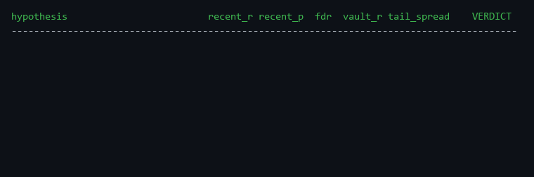

# octagon


[](https://codespaces.new/brett-kerigan/octagon)

A persona-agnostic harness for **adversarial idea generation gated by an incorruptible
reality test.** A pure turn-scheduler (the **octagon**) seats one to four **personas** that
argue past each other to surface bold, testable hypotheses. A separate gate then tries its
hardest to prove each hypothesis is a fluke. Nothing is believed until it survives.

Pure standard library. The engine has no third-party dependencies, and the full test suite
runs offline.



## The problem

On a genuinely hard search problem ("is there an overlooked edge here?"), a single
well-behaved model walks straight to the reasonable answer: *"there's probably nothing
here."* That answer is usually correct and completely useless. The interesting hypotheses
live out past where one careful reasoner is willing to go, and most of them are wrong. You
need something that manufactures a lot of uncomfortable, specific, testable provocations,
and something else that is merciless about killing the ones that do not hold up.

This project separates those two jobs and makes the second one incorruptible.

## The approach

```
PROVOKE  ->  DIRECTION  ->  OPERATIONALIZE  ->  DECIDE  ->  [ REALITY is the judge ]
(dreamer/    (behavioral    (skeptic: turn it    (gambler:    (a real test. Eloquence
 fool:       scientist:     into a test a        is it worth   cannot talk its way
 refuse      which bias,    mirage cannot        the cost?)    through a backtest.)
 the null)   which corner)  fake)
```

- **The octagon** (`octagon.py`) is a pure scheduler: it seats up to four personas, runs
  them in order for N rounds, threads the running transcript through every turn, isolates
  faults so one misbehaving persona cannot abort a round, and stops on a round cap or a
  predicate. It knows nothing about who rides in it. A persona is anything with a `.name`
  and a `.speak(transcript) -> str`.
- **The personas** (`personas/`) are a draftable bench of functional roles: the dreamer
  (refuse the null), the fool (break the groupthink), the behavioral scientist (name the
  bias), the practitioner and insider (domain-cast experts), the gambler (decide what is
  worth testing), the skeptic (turn a hunch into a trap noise cannot pass). The diversity
  that matters is diversity of *function*, not four flavors of "have an idea."
- **The gate** (`forge.py`) is the half that makes the rest safe. It does not find edges;
  it refuses to be fooled by them. Three protections, learned the hard way:
  1. **per-era coherence**: the effect must keep one sign across every era it appears in,
     with a hard significance requirement on the **most recent era** (edges decay; a signal
     that flips direction era to era, or is dead today, never passes);
  2. **Benjamini-Hochberg FDR** across the whole batch (testing 100 ideas and keeping the
     "best" is how you confirm dice at industrial scale);
  3. a **sacred vault**: a final holdout that survivors get exactly one shot at.
- **The ledger** (`alpha_ledger.py`) enforces pre-registration: a hard test budget declared
  up front, results only after registration, and a guard that forbids quietly dropping
  inconvenient tests to shrink the family. This is what stops a re-slice campaign from
  p-hacking itself.

The decider is not a seat. **Reality is.** The octagon's output is a testable hypothesis
worth taking to the gate, never a verdict.

## Where this sits

This is not an agent-team framework. If you want autonomous agents that *do work for
you* — crews, workflows, tool use — that is [CrewAI](https://github.com/crewAIInc/crewAI)
or [AutoGen](https://github.com/microsoft/autogen), and they are good at it. If you want
evidence that multi-agent *debate* improves accuracy on tasks with right answers, that is
the [multiagent-debate line of work](https://arxiv.org/abs/2305.14325). Octagon is for a
different job: adversarial hypothesis generation on problems *without* a right answer,
where the thing that matters most is that **the generator never grades its own work** —
belief is earned only through a statistical gate the model cannot talk its way past.

## One real example (functionality, demonstrated)

The gate ships with a synthetic proof you can run yourself. It plants known signals (a real
one, a decayed one, an overfit one, a tail-shaped one) into a batch padded with 20 pure-noise
nulls, then runs the full protocol:

```
$ python forge.py --demo

hypothesis                         recent_r recent_p  fdr  vault_r  tail_spread    VERDICT
------------------------------------------------------------------------------------------
REAL linear     (holds everywhere)   0.2439      0.0    Y   0.2592       0.7795       REAL
DECAYED         (died post-2020)     0.0303   0.5451    n     None       0.2596    DECAYED
MIRAGE/overfit  (discovery only)     0.1304   0.0087    Y   0.0239       0.5917     MIRAGE
TAIL (tail-shaped)                   0.4764      0.0    Y   0.5452       2.4031       REAL
------------------------------------------------------------------------------------------
20 pure-noise nulls -> 0 survived as REAL (FDR <= 10%).
```

A real signal is confirmed, a signal that died in the recent era is marked DECAYED (not
REAL), an overfit signal fails the vault and is caught as a MIRAGE, and **all 20 noise
hypotheses are correctly rejected.** This is a functionality claim: it is provable, and the
test suite asserts it.

## How to run

Zero dependencies — clone and run:

```bash
python demo.py            # offline: a full octagon run with deterministic stub personas
python forge.py --demo    # the synthetic gate proof shown above (no data needed)
python -m adapters.reslice    # a pre-registered re-slice campaign against a synthetic gate
python -m pytest -q       # the full offline test suite (the one dev dep: pip install pytest)
```

Or install the `octagon` command (`pip install -e .`), or run it with nothing installed:

```bash
uvx --from git+https://github.com/brett-kerigan/octagon octagon gate --demo
```

`octagon doctor` tells you which model backends this machine can run live.

### Use it as a skill (zero setup)

Open this repo in Claude Code (or any agent that reads `SKILL.md`) and type `/octagon`:
the model you are already running becomes the table — one isolated subagent per seat —
and the deterministic gate stays in Python. No API keys, no configuration. To make it
available everywhere, copy `.claude/skills/octagon/` into `~/.claude/skills/`.

### Going live from the command line

Any headless agent CLI you already subscribe to can power a seat — no API keys, the
CLIs use their own logins:

| backend                | powered by                     | flag                          |
|------------------------|--------------------------------|-------------------------------|
| your current agent     | the `/octagon` skill           | (none — zero setup)           |
| Claude                 | `claude` CLI                   | `--room=claude`               |
| Codex                  | `codex` CLI                    | `--room=codex`                |
| Gemini                 | `gemini` CLI                   | `--room=gemini`               |
| local models           | Ollama                         | `--room=ollama --model=...`   |
| anything OpenAI-compat | OpenRouter, LM Studio, vLLM, … | `--room=openai` + env vars    |

```bash
python demo.py --room=ollama --harvest=claude      # cheap divergence, strong synthesis
python demo.py --room=claude --dye=fool=codex      # dye one seat a different family
```

`--dye=seat=backend` exists because of the shared-basin warning below: one seat from a
different model family is the cheap antidote.

## Honest limitations

- **Whether multi-persona divergence actually beats a single strong model on open-ended
  creative work is an open question, not a settled result.** The evidence that role-play
  diversity helps is strongest on tasks with a right answer; this targets tasks without one.
  When all seats run on one model family, watch for *shared-basin collapse*, every seat
  exploring the same idea-space. The client is injectable precisely so you can dye one seat a
  different model.
- **This is a throughput tool. The gate is where the value lives.** Loud divergent
  generation is worthless without a brutal, cheap, incorruptible test downstream. Most
  hypotheses a good roundtable produces are wrong; that is the design, not a defect.
- **No efficacy claim is made here.** The harness is demonstrated to work as specified
  (see the tests). Whether it finds *you* an edge in *your* domain is unproven and would need
  its own evaluation. See [CASE_STUDY.md](CASE_STUDY.md) for one real application, framed as a
  case study rather than proof.

## Help wanted

The honest open question is worth collaborating on: **does function-diverse role-play
generation, run on one strong model, produce more useful divergence than that model prompted
once?** Du et al. ([arXiv:2305.14325](https://arxiv.org/abs/2305.14325), ICML 2024) showed
multiagent debate helps on tasks *with* right answers (math, factuality, MMLU); this
project targets the open cousin of that question — tasks without one. It needs a real
eval: a task set without ground-truth answers, blind scoring of harvested hypotheses,
single-model baseline versus the roundtable. If that interests you, open an issue.

## License

MIT. See [LICENSE](LICENSE).
